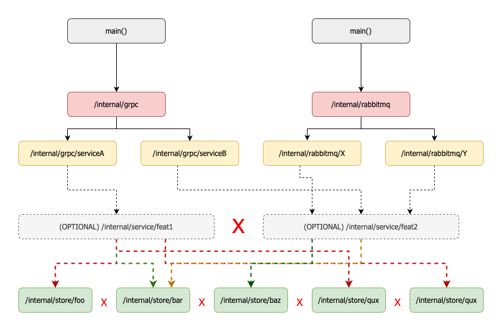
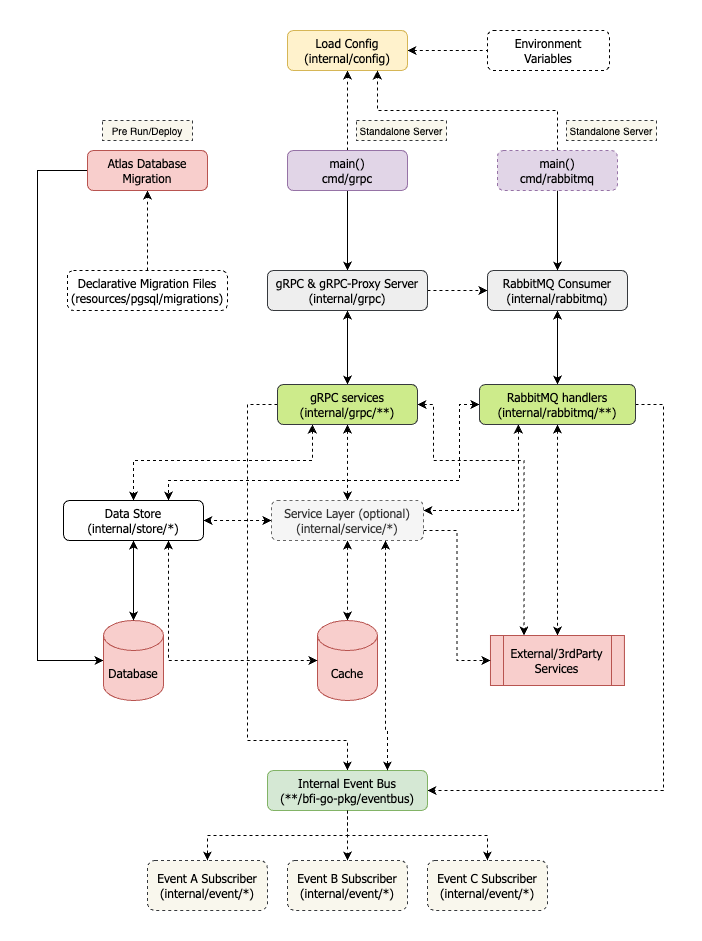

## Development

After first cloning `bravo-go-template` as a repository template, you need to change following files:

- Run following commands in the root repo folder, assuming `new-package-name` is the new name:
  - `find . -type f -name '*.go' -exec sed -i '' -e "s/bravo-go-template/new-package-name/g" {} \;`
  - `find . -type f -name '.golangci.yml' -exec sed -i '' -e "s/bravo-go-template/new-package-name/g" {} \;`
  - `find . -type f -name '.env.example' -exec sed -i '' -e "s/bravo-go-template/new-package-name/g" {} \;`

### Directory Structure

```
.
├── cmd                   // contains main entry point for server identified by folder name.  
│   └── grpc              // main entry point for gRPC server.
├── docs                  // contains documentation that is related to the current service.
├── internal              // working folder for feature development.
│   ├── config            // main app config which also handle loading from environment variables.
│   ├── event             // to handle internal event-bus pub-sub mechanism.
│   ├── grpc              // working folder for gRPC service implementation.
│   │   └── hc            // gRPC healthcheck service.
│   ├── service           // optional layer to work with feature-scoped functionality.
│   └── store             // working folder for data store (repository) interface dan its data structure.
│       ├── cachedstore   // proxyied store interface to add/remove cache for actual data store call.
│       ├── pg            // implementation of data store interface using PostgreSQL.
│       └── tracedstore   // optional proxy to handle open telemetry tracing to data store interface. 
├── pkg                   // reusable packages for internal. 
├── resources             // contains files that is required for the runtime.
│   └── pgsql
│       └── migrations    // contains PostgreSQL database migration files.
└── tools                 // contains toolings related to service development identified by package name.
```

Each folder inside this repo contains README.md file which briefly explains what is the intention of the folder.

See following figure on how each Go package in those folder communicates:

<p align="center">
  
</p>

### Requirements

- [Docker](https://github.com/docker/cli) and [Docker Compose](https://github.com/docker/compose)
- Go >=1.19
    - Verify with `go version`
- Make
    - Verify with `make --version`

### Notes

See the following figure below for a visual illustration flow of the code structure:

<p align="center">
  
</p>

Most of the work for feature development should be done in the `internal` folder,
especially `internal/grpc`, `internal/store` and or `internal/service`.

To make sure the code is as simple and explicit, testable, and efficient as possible.
Please avoid making too many layers or abstractions, see [Effective Go](https://go.dev/doc/effective_go) as the reference.

For best practice and style guides, we can refer to following references:

- [Google Go Style Guide](https://google.github.io/styleguide/go/)
- [Uber Go Style Guide](https://github.com/uber-go/guide/blob/master/style.md)

### Entry Point

A repository can contain multiple deployable server and differentiated by each `main` entry point. Please put a `main()` in each of the folder, for example:

```
./
    /cmd
        /grpc           <--- Dedicated server to serve gRPC as the main server (which can also contain RabbitMQ consumer that is related to its functionality).
        /rabbitmq       <--- Dedicated server to consume RabbitMQ message and deployed independently.
        /other-server   <--- Another dedicated server.
```

See [bravo-go-example/cmd](https://github.com/bfi-finance/bravo-go-example/tree/main/cmd) as the reference for multiple `main` entrypoint per repository.

### Where is the protobuf definition?

All proto files are centralized in [bfi-protobuf](https://github.com/bfi-finance/bfi-protobuf) repository.

We should discuss and write the proto contracts in that repository before start writing the actual implementation, and will do iteration from there.

All files and its REST API documentation will be generated there, it should be `go get-able` and ready to consume.

### How do I add new REST API endpoint?

All proto files are centralized in [bfi-protobuf](https://github.com/bfi-finance/bfi-protobuf) repository.

We use [GRPC-REST API gateway](https://github.com/grpc-ecosystem/grpc-gateway) to serve JSON-based REST API which is defined as proto definition.

Once protobuf generated the central proto repository, we implement the service inside `internal/grpc/{service_name}`.

### What are the typical flow of the gRPC/REST API request to the response?

- `main` constructing all infra object dependencies (config, db, logger, etc...), and then construct the server.
- Request coming from HTTP (both gRPC or REST API Proxy) will be handled by `internal/grpc`
- `internal/grpc` will construct required store, service and register gRPC service implementation.
- On REST API call, the HTTP request will be proxied to gRPC server.
- On incoming request, gRPC server will call registered gRPC service implementation and handle the request.

### How do I add new PostgreSQL table?

We are using [declarative migration](https://atlasgo.io/concepts/declarative-vs-versioned) using [Atlas](https://atlasgo.io/) and the schema definition is located in [resources/pgsql/migrations](./resources/pgsql/migrations).

It is means that we define our desired state/schema of our database and Atlas will define necessary steps to achieve that (think like Terraform, but for database).

Adjust [resources/pgsql/migrations/schema.sql](./resources/pgsql/migrations/schema.sql) accordingly, BUT PLEASE DON'T DO DESTRUCTIVE CHANGES (e.g., renaming, deleting columns).

### How do I add new data store interface and implementation?

The interface and its data struct should be placed in `internal/store` folder,
and the implementation should placed in its own package inside `internal/store`,
for example, for postgres implementation we will place it under `internal/store/pg`.

For data store consumer/caller it should accept interface of the store,
not the actual pointer struct of the implementation.

### How do I add traced interface call?

Create new implementation rather than mixing with existing implementation, for example:

```go
// /path/to/store/
// the interface
type Doer interface {
    Do(ctx context.Context) error
}
```

Actual implementation (postgres implementation for example):

```go
// /path/to/store/pg
type Doer struct {
    db *sql.DB
}

func (s *Doer) Do(ctx context.Context) error {
	// do something
    return nil
}
```

Traced for postgres implementation:

```go
// /path/to/store/pgtraced
type Doer struct {
    actual store.Doer
}

func NewDoer(actual store.Doer) *Doer {return &Doer{actual: actual}}

func (s *Doer) Do(ctx context.Context) error {
    trace := tracer.FromContext(ctx)
    span := tracer.New("doer do")
    span.Start()
    err := s.actual.Do(ctx)
    span.Stop()
    return err
}
```

Finally, to provide wrapper implementation to be consumed by service package, we do following:

```go
doerPg := pg.NewDoer(sqlDB)
doerTraced := tracedstore.NewDoer(doerPg)

svc := service.NewFoo(doerTraced)
```

### How do I add caching mechanism to a data store call?

Similar with traced call and locate it in different package, for example:

- `/store` : data store interface location
- `/store/pg` : postgres data store implementation
- `/store/tracedstore` : traced store implementation
- `/store/cachedstore` : cached store implementation